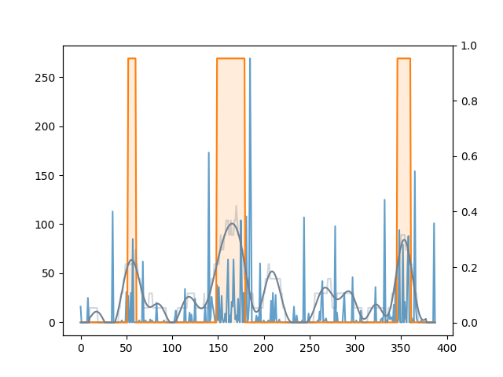
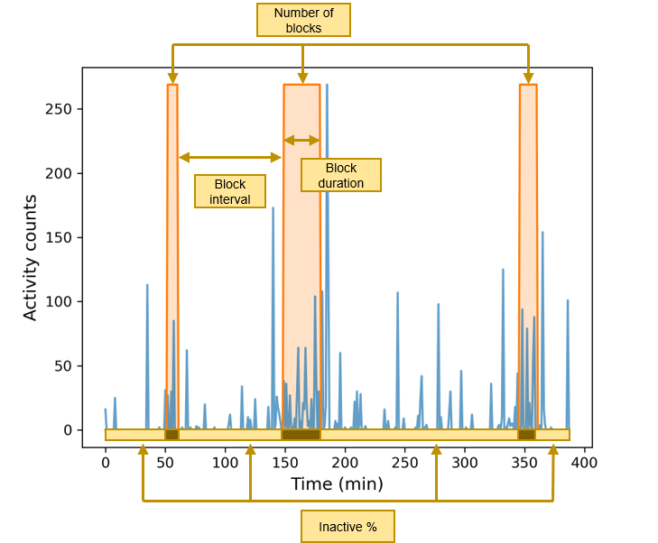
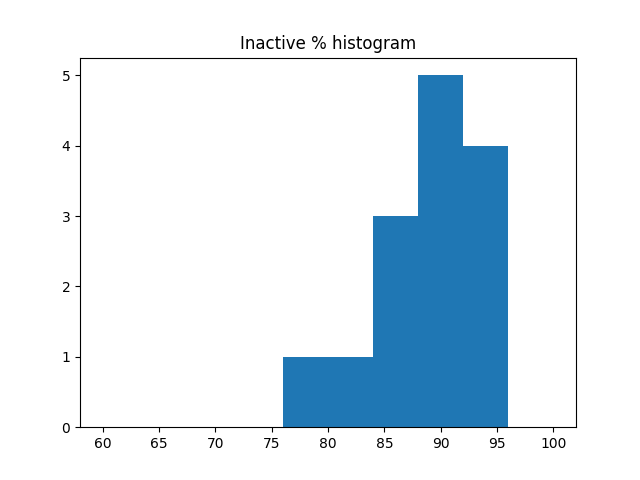
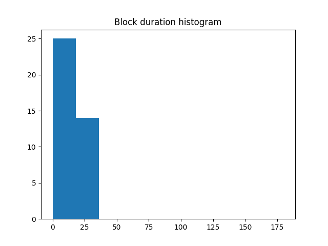
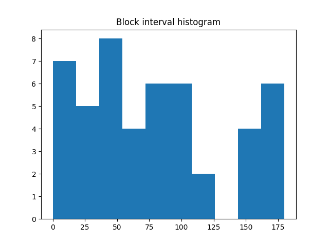
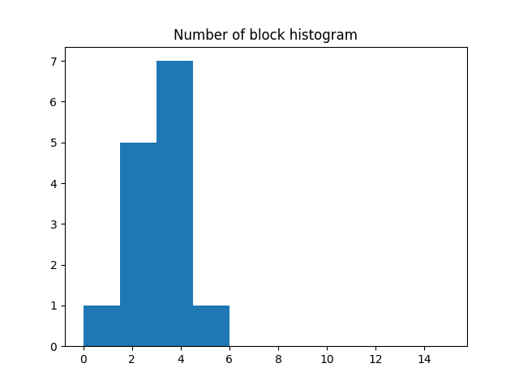

## RBD_actigraphy

This is an analysis that evaluates motor activities during sleep.  
This analysis do not evaluate motor activities in epoch units, but quantify them as a continuous block.  
You can visualize motor activity block (MAB) on the raw accelerometer data and get 4 evaluation indices that provides characteristics of motor activity during sleep.    
These code works with a csv file extracted from 'Actiwatch Spectrum PRO, Philips Respironics, Murrysville, PA, USA'  
'pyActigraphy' package was used together with this code for analysis

## Code description
### MAB analysis
main analysis code
### MAB analysis_figure
code that produces graphics illustrating the analysis's methodology and outcomes using a single night sample data
### FLM_func
modified module to apply functional linear modeling to sleep part of actigraphy data

## Figure
### Analysis procedure (A single night sample data)


<b>y axis (left)</b> : activity counts (of raw signal)   
<b>y axis (right)</b> : the ratio of epochs with 20-100 activity counts within the 20-min window    
<b>x axis</b> : time (min)    

<b>blue line</b> : raw actigraphy signal  
<b>light gray line</b> : the ratio of epochs with 20-100 activity counts within the 20-min window  
<b>dark gray line</b> : ratio smoothed with functional linear modeling   
<b>orange area</b> : the areas beyond the 20% ratio (motor activity block)  
## 
### 4 indices of motor activity block analysis
  
<b>inactive %</b> : average ratio of the non-block portion during sleep  
<b>duration</b> : average duration of the blocks during sleep  
<b>interval %</b> : average interval of the blocks during sleep  
<b>number %</b> : average number of the blocks during sleep  

## Results 
You can get detailed MAB analysis results about each block and interval
```
Sleep 12  
Sleep-to-1st block interval:  0 days 02:58:00  

Block 1  
Start point:  2022-04-30 01:08:00  
Stop point:  2022-04-30 01:24:00  
Duration:  0 days 00:16:00  

Block-to-block interval:  0 days 01:56:00  

Block 2  
Start point:  2022-04-30 03:22:00  
Stop point:  2022-04-30 03:47:00  
Duration:  0 days 00:25:00  

Block-to-wake interval:  0 days 01:14:00  

### Motor Activity Block summary for sleep 12  
Inactive %:  90 %  
Mean duration:  0 days 00:20:30  
Mean interval:  0 days 02:02:40  
Mean number of blocks:  2  
```
## 
You can get the daily and summary reports in the results

```
### Motor Activity Block summary for sleep 14  
Inactive %:  89 %  
Mean duration:  0 days 00:19:00  
Mean interval:  0 days 01:46:00  
Mean number of blocks:  2  
```

```
Average MAB indices over 14 days  
Mean inactive %:  89 %  
Mean duration:  0 days 00:15:26  
Mean interval:  0 days 01:33:36  
Mean number of blocks:  2.79  
```  
## 
You can also get histograms for the 4 indices of MAB analysis  

  


