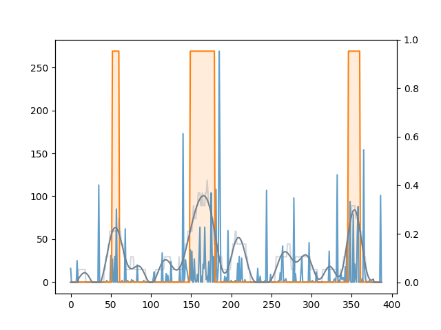

## RBD_actigraphy
This is an analysis that evaluates motor activities during sleep.  
This analysis do not evaluate motor activities in epoch units, but quantify them as a continuous block.  
You can visualize motor activity block (MAB) on the raw accelerometer data and get 4 evaluation indices that provides characteristics of motor activity during sleep.  

You can get the daily and total reports in the results

```
### Motor Activity Block summary for one night ###
Inactive %:  0.889196675900277
Mean duration:  0 days 00:19:00
Mean interval:  0 days 01:46:00
Mean number of block:  2
```

```
Total characteristics
Total inactive %:  0.89
Total mean duration:  0 days 00:15:26.153846153
Total mean interval:  0 days 01:33:36.226415094
Total mean number of active block:  2.79
```

## Code description
### MAB analysis
main analysis code
### MAB analysis_figure
code that produces graphics illustrating the analysis's methodology and outcomes using a single night sample data
### FLM_func
modified module to apply functional linear modeling to sleep part of actigraphy data

## Example plot
### All in one plot (A single night sample data)


<b>y axis (left)</b> : activity counts (of raw signal)   
<b>y axis (right)</b> : the ratio of epochs with 20-100 activity counts within the 20-min window    
<b>x axis</b> : time (min)    

<b>blue line</b> : raw actigraphy signal  
<b>light gray line</b> : the ratio of epochs with 20-100 activity counts within the 20-min window  
<b>dark gray line</b> : ratio smoothed with functional linear modeling   
<b>orange area</b> : the areas beyond the 20% ratio (motor activity block)
